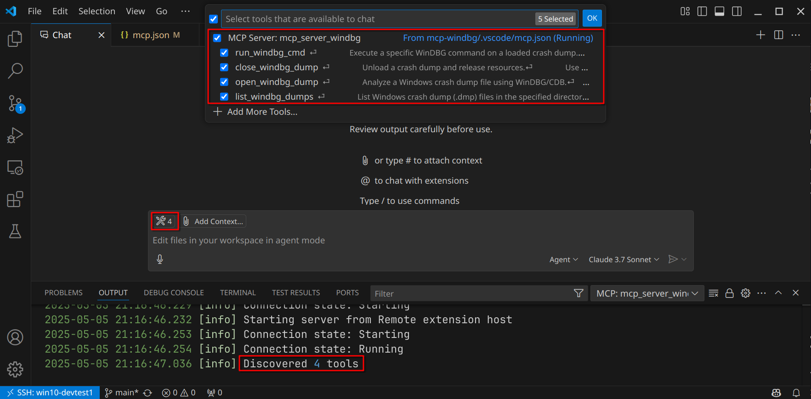

# MCP Server for WinDBG Crash Analysis

A Model Context Protocol server providing tools to analyze Windows crash dumps and connect to remote debugging sessions using WinDBG/CDB.

## Overview

This MCP server integrates with [CDB](https://learn.microsoft.com/en-us/windows-hardware/drivers/debugger/opening-a-crash-dump-file-using-cdb) to enable AI models to:
- Analyze Windows crash dumps
- Connect to remote debugging sessions
- Execute WinDBG commands on both dump files and live debugging targets

## TL;DR 

### What is this?

- Primarily, a tool that enables AI to interact with WinDBG for both crash dump analysis and live debugging.
- The whole "magic" is giving LLMs the ability to execute debugger commands on crash dumps or remote debugging targets. Used creatively, this is quite powerful and a big productivity improvement.

This means, that this is:

- A bridge connecting LLMs (AI) with WinDBG (CDB) for assisted crash dump analysis and remote debugging.
- A way to get immediate first-level triage analysis, useful for categorizing crash dumps or auto-analyzing simple cases.
- A platform for natural language-based "vibe" analysis, allowing you to ask the LLM to inspect specific areas:
  - Examples for **crash dump analysis**:
    - "Show me the call stack with `k` and explain what might be causing this access violation"
    - "Execute `!peb` and tell me if there are any environment variables that might affect this crash"
    - "Examine frame 3 and analyze the parameters passed to this function"
    - "Use `dx -r2` on this object and explain its state" (equivalent to `dx -r2 ((MyClass*)0x12345678)`)
    - "Analyze this heap address with `!heap -p -a 0xABCD1234` and check for buffer overflow"
    - "Run `.ecxr` followed by `k` and explain the exception's root cause"
  - Examples for **remote debugging**:
    - "Connect to tcp:Port=5005,Server=192.168.0.100 and show me the current thread state"
    - "Set a breakpoint on function XYZ and continue execution"
    - "Check for timing issues in the thread pool with `!runaway` and `!threads`"
    - "Examine memory around this address with `db/dw/dd` to identify corruption patterns"
    - "Show me all threads with `~*k` and identify which one is causing the hang"
    - ...and many other analytical approaches based on your specific debugging scenario

### What is this not?

- A magical solution that automatically fixes all issues.
- A full-featured product with custom AI. Instead, it's a **simple Python wrapper around CDB** that **relies** on the **LLM's WinDBG** expertise, best complemented by your own domain knowledge.

## Blog

I've written about the whole journey in blog.

- [The Future of Crash Analysis: AI Meets WinDBG](https://svnscha.de/posts/ai-meets-windbg/)

## Prerequisites

- Python 3.10 or higher
- Windows operating system with **Debugging Tools for Windows** installed.
  - This is part of the [Windows SDK](https://developer.microsoft.com/en-us/windows/downloads/windows-sdk/).
- A LLM supporting Model Context Protocol.
    - I have tested with Claude 3.7 Sonnet through GitHub Copilot and I am pretty statisfied with the results.
  - For GitHub Copilot, requires Model Context Protocol in Chat feature enabled.
  - See [Extending Copilot Chat with the Model Context Protocol (MCP)](https://docs.github.com/en/copilot/customizing-copilot/extending-copilot-chat-with-mcp).


## Development Setup

1. Clone the repository:

```bash
git clone https://github.com/svnscha/mcp-windbg.git
cd mcp-windbg
```

2. Create and activate a virtual environment:

```bash
python -m venv .venv
.\.venv\Scripts\activate
```

3. Install the package in development mode:

```bash
pip install -e .
```

4. Install test dependencies:

```bash
pip install -e ".[test]"
```

## Usage

### Integrating with VS Code

To integrate this MCP server with Visual Studio Code:

1. Create a `.vscode/mcp.json` file in your workspace with the following configuration:

```json
{
    "servers": {
        "mcp_server_windbg": {
            "type": "stdio",
            "command": "${workspaceFolder}/.venv/Scripts/python",
            "args": [
                "-m",
                "mcp_server_windbg"
            ],
            "env": {
                "_NT_SYMBOL_PATH": "SRV*C:\\Symbols*https://msdl.microsoft.com/download/symbols"
            }
        },
    }
}
```

Alternatively, edit your user settings to enable it globally (independent of workspace).
Once added and with Model Context Protocol in Chat feature enabled, the tools from this model context protocol server are available in Agent mode.

That's how it should look like:




### Starting the MCP Server (optional)

If integrated through Copilot, you don't need this. The IDE will auto-start the MCP.

Start the server using the module command:

```bash
python -m mcp_server_windbg
```

### Command Line Options

```bash
python -m mcp_server_windbg [options]
```

Available options:

- `--cdb-path CDB_PATH`: Custom path to cdb.exe
- `--symbols-path SYMBOLS_PATH`: Custom symbols path
- `--timeout TIMEOUT`: Command timeout in seconds (default: 30)
- `--verbose`: Enable verbose output


2. Customize the configuration as needed:
   - Adjust the Python interpreter path if needed
   - Set custom paths for CDB by adding `"--cdb-path": "C:\\path\\to\\cdb.exe"` to the `args` array
   - Set the symbol path environment variable as shown above, or add `"--symbols-path"` to the args

### Integration with Copilot

Once the server is configured in VS Code:

1. Enable MCP in Chat feature in Copilot settings
2. The MCP server will appear in Copilot's available tools
3. The WinDBG analysis capabilities will be accessible through Copilot's interface
4. You can now analyze crash dumps directly through Copilot using natural language queries

## Tools

This server provides the following tools:

### Crash Dump Analysis
- `open_windbg_dump`: Analyze a Windows crash dump file using common WinDBG commands
- `close_windbg_dump`: Unload a crash dump and release resources

### Remote Debugging
- `open_windbg_remote`: Connect to a remote debugging session using a connection string (e.g., `tcp:Port=5005,Server=192.168.0.100`)
- `close_windbg_remote`: Disconnect from a remote debugging session and release resources

### Local Debugging with WinDbg backed via .js script
- `attach_windbg`: Connect to a local WinDbg session (instead of running cdb.exe). The session needs to load the windbg_mcp_plugin.js util (`.scriptload /path/to/windbg_mcp_plugin.js`)
- `close_windbg_attach`: Close the channel to a running local WinDbg session.

### General Commands
- `run_windbg_cmd`: Execute a specific WinDBG command on either a loaded crash dump or active remote session
- `list_windbg_dumps`: List Windows crash dump (.dmp) files in the specified directory

## Running Tests

To run the tests:

```bash
pytest
```

For live testing of attached windbg session, make sure the `DbgX.Shell.exe` process is running and that the `windbg_mcp_plugin.js` script is running inside it after `!mcp_init`

## Troubleshooting

### CDB Not Found

If you get a "CDB executable not found" error, make sure:

1. WinDBG/CDB is installed on your system
2. The CDB executable is in your system PATH, or
3. You specify the path using the `--cdb-path` option

### Symbol Path Issues

For proper crash analysis, set up your symbol path:

1. Use the `--symbols-path` parameter, or
2. Set the `_NT_SYMBOL_PATH` environment variable

### Common Symbol Paths

```
SRV*C:\Symbols*https://msdl.microsoft.com/download/symbols
```

## License

MIT